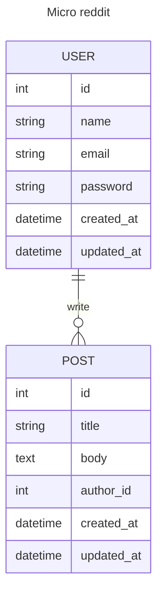

# Members only

## Introduction

In this project, you’ll be building an exclusive clubhouse where your members can write anonymous posts. Inside the clubhouse, members can see who the author of a post is but, outside, they can only see the story and wonder who wrote it.

## Data model

